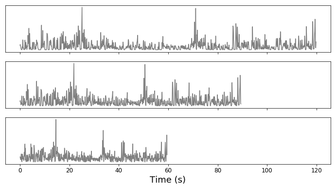

# ILRA

This python program will fix low audio levels, increase playback speed, and remove silent sections from video files. 

Made this while procrastinating on watching old lecture recordings, so that I could watch the recordings faster to make up for the time I procrastinated.

---

- Top: initial audio from a 2-minute long video clip.
- Middle: Audio after removing all silences (any section where the volume is less than 10% of the max volume, in this case).
- Bottom: Audio after increasing playback speed by 1.5x.

Video editing functionality comes largely from [MoviePy](https://zulko.github.io/moviepy/), audio editing comes largely from [LibROSA](https://librosa.github.io/librosa/).
